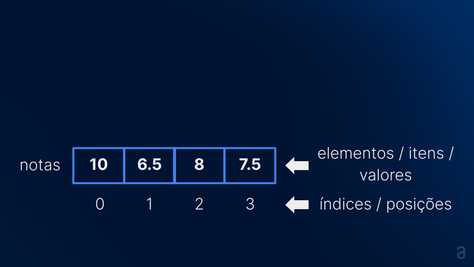

# JavaScript Array

```javascript
const numero1 = 50;
const numero2 = 43;
const numero3 = 12;

// Utilizando array
const numeros = [50, 43, 12];
```

Um array pode ser definido como uma lista ordenada de valores enumerados, onde cada valor é chamado de elemento ou item, e cada elemento está localizado em uma posição na lista chamada de índice. Vamos explorar esses conceitos em detalhes.

## Lista Ordenada de Valores Enumerados

Quando falamos de valores, estamos nos referindo a dados de algum tipo, como string (texto), number (número), booleano (true ou false), ou outros dados reconhecidos pelo JavaScript.

```javascript
const arrayDeNumeros = [50, 43, 12];
const arrayDeStrings = ["banana", "alura", "Juliana"];
```

Uma lista ordenada implica que os dados no array estão em uma ordem definida e permanecerão nessa ordem, a menos que haja alguma modificação no array. Cada valor está associado a um identificador numérico, conhecido como índice.

## Elemento ou Item

Em programação, é crucial conhecer os nomes dos itens para facilitar a resolução de dúvidas, procurar soluções e ler documentação. Quando trabalhamos com arrays, cada valor na lista é chamado de elemento ou item.

```javascript
// Array com 1 elemento
const numero = [5];

// Array com 3 elementos
const nums = [50, 43, 12];
```

Lembrando que cada elemento corresponde a um dado, separados por vírgula. O espaço é opcional, mas facilita a leitura.

## Índice

Se um array é uma lista ordenada, é possível acessar cada valor se soubermos a posição dele na lista, chamada de índice.

```javascript
const nums = [50, 43, 12];
// O número 43 está na posição 1 (segunda posição) nessa lista de três números.
```

Em programação, chamamos de índice o número que identifica a posição de um valor em um array. Importante observar que em JavaScript (e na maioria das linguagens de programação), a contagem dos índices começa no número 0.

```javascript
// Índice     0   1   2   3
const nums = [50, 43, 12, 98];
```

## Propriedade `length`

A propriedade `length` especifica o tamanho de um array, ou seja, o número de elementos contidos no array.

```javascript
// Índice     0   1   2   3
const nums = [50, 43, 12, 98];
console.log(nums.length); // 4
```




## Propriedade `push`

A propriedade `push` No contexto de arrays, esse termo significa "inserir" na lista.

```javascript
const notas = [10, 6, 8];
notas.push(7);
const media = (notas[0] + notas[1] + notas[2]) / notas.length;
console.log(media);
```

Certamente! Vamos intercalar os exemplos com o texto para uma apresentação mais fluida:

##### Exemplos dos Principais Métodos para Manipulação de Arrays em JavaScript

### `concat()`

```javascript
const array1 = [1, 2, 3];
const array2 = [4, 5, 6];
const newArray = array1.concat(array2);

console.log(newArray); // Saída: [1, 2, 3, 4, 5, 6]
```

O método `concat()` junta dois arrays, criando um novo array resultante da concatenação.

### `filter()`

```javascript
const numeros = [10, 15, 20, 25, 30];
const numerosPares = numeros.filter(numero => numero % 2 === 0);

console.log(numerosPares); // Saída: [10, 20, 30]
```

O método `filter()` retorna uma lista contendo elementos que passaram em um teste definido por uma função fornecida.

### `find()`

```javascript
const frutas = ["maçã", "banana", "laranja"];
const frutaEncontrada = frutas.find(fruta => fruta === "banana");

console.log(frutaEncontrada); // Saída: banana
```

O método `find()` retorna o primeiro valor que satisfaz um teste definido por uma função.

### `pop()`

```javascript
const letras = ["a", "b", "c"];
const ultimaLetra = letras.pop();

console.log(ultimaLetra); // Saída: c
console.log(letras); // Saída: ["a", "b"]
```

O método `pop()` remove o último elemento do array, alterando o array original.

### `push()`

```javascript
const cores = ["vermelho", "azul"];
cores.push("verde");

console.log(cores); // Saída: ["vermelho", "azul", "verde"]
```

O método `push()` adiciona um elemento na última posição do array, alterando o array original.

### `reduce()`

```javascript
const numeros = [1, 2, 3, 4, 5];
const soma = numeros.reduce((acumulador, numero) => acumulador + numero, 0);

console.log(soma); // Saída: 15
```

O método `reduce()` utiliza uma função definida pelo usuário para acumular os resultados em uma variável, retornando um único valor no final.